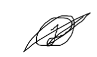
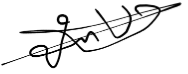

# COOPERATION AGREEMENT
Project <Msafe> Mobile Development Semester - Hogeschool van Amsterdam
Team members and contact information

Joey de Jong 
Student nr. 500879621 
Joey.de.jong@hva.nl 
Joeydejong1112@gmail.com 
+31 6 14374491 

Alexander Diependaal 
Student nr. 500784534 
Alex.diependaal@hva.nl 
Alexdiependaal@gmail.com 
+31 6 20902672 

Jill Jessurun 
Student nr. 500856242 
jill.jessurun@hva.nl 
jilljessurun@gmail.com 
+31 6 12805526 

JUNGHEE KIM 
Student nr. 500917886 
jung.kim2@hva.nl 
wjdgml3834@hanyang.ac.kr 
+31 6 10651064 

Mo kadib alban 
Student nr. 500817452 
mo.kadib.alban@hva.nl 
+31 612362712 

## AGREEMENTS

In this cooperation agreement, the undersigned declare to agree to the following agreements and to act accordingly:

* The project is worked on every Tuesday and Wednesday at a pre-agreed location at pre-agreed times. If one of the team members is unexpectedly unable to attend one of these appointments, he or she must provide a good reason, such as illness or a funeral, and communicate this well with all other team members, by email or whatsapp. If the other team members agree with the reason for absence, the relevant team member will be released from the appointment.

* Team members must be on time for appointments. If a team member arrives late three times more than half an hour, this will have the following consequences. If a team member is late through no fault of his or her own and therefore has a good reason for this, this must be communicated to the group so that any consequences are excluded.

* Communication within the group must be adequate at all times. This is done via email, MS Teams, Discord, Whatsapp, and/or verbally. This means that group members must be reachable within twelve hours so that everyone knows at all times what is expected of everyone. If the group decides that a team member is not accessible or is too difficult to reach, this will entail the following consequences.

* All group members should be actively involved in the project and help each other if desired. If the team decides that a team member is not committed enough to the project or does not work well in a group, this will have consequences for the team member concerned. This also means that when working together, all team members adopt an active working attitude and are actively committed to the group and the work.

* All team members must meet agreed deadlines. If a team member does not meet a deadline, this will be charged to him or her and will result in consequences.

* The roles will be rotated so every team member will have experience with all the roles0

## DEFINITION OF DONE

Definitions of Done (DoDs) are determined and pursued per backlog item in consultation with the team. These DoDs determine when a backlog entry is marked as 'finished'. In consultation with the team, these DoDs are drawn up, pursued, possibly adjusted and it is ultimately decided whether the item in question can actually be labeled as 'finished'.

## CONSEQUENCES

If a team member does not adhere to the above agreements or to a lesser extent, this will have consequences. The group judges whether a team member behaves properly within the group. If the majority of the group decides that a team member does not comply with the agreements, a joint consultation will initially be organized in which the injured group members explain their situation to the non-functioning team member and warn him of future consequences if he or she does not improve his behavior. Failure to do so will result in the following consequences:

A crisis meeting will take place between the non-functioning team member and the other team members. The project coach is present during this crisis meeting. During this meeting, the functioning of the group and that of individual members is discussed. At the end (new) agreements are made and a period follows in which the non-functioning member must prove that he can function within the team. In other words: the team member must have measurable added value and be responsible for the team result. The agreements made in this meeting are recorded in writing.

When this period has elapsed, a new conversation takes place between the team members and the coach. If, in the opinion of the team and the coach, insufficient or no progress has been made, the member concerned will be dismissed. It is possible that a team will eventually continue in the project with fewer members. An alternative route may be agreed upon in consultation with the project management. Of course, it is not the intention that a team of two members should do exactly the same as a team with five team members.

If the relevant team member is not present at one of the two conversations, the team member will be fired.

## LEARNING OBJECTIVES

For the Mobile Development theme semester, which this project belongs to, each team member has formulated learning objectives in the competence development plan of his portfolio. These learning objectives are discussed per team member in Appendix 1. These learning objectives are noted here so that all team members are aware of each other's learning objectives and can help each other achieve them.

## CUSTOMER CONTACT
Contact person	: Atze Zwirs (CEO) 
Email			: atze.zwirs@msafe.nl 
Telephone		: 06 16614304 

## THE UNDERSIGNED

The undersigned hereby declare that they agree to the terms and conditions contained in this contract and will act in accordance with these terms and conditions. This contract describes which agreements are made for the smooth progress of this project and what the consequences will be if one of the group members does not keep to these agreements. Furthermore, all contact details of the team members are listed in this contract.

Alex diependaal

Jill Jessurun

Joey de Jong

JUNGHEE KIM

Mo kadib alban

