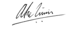
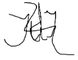
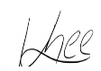
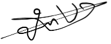
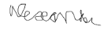
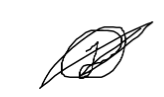

# Agreement

[mSafe_sign.pdf](uploads/08e3c90aced8fcea82d7b11a9c71c1bf/mSafe_sign.pdf)

**This agreement is made by and between:**

1. Amsterdam University of Applied Sciences, having its registered office at Wibautstraat 3B, 109 Amsterdam, duly represented by the ICT Programme manager , hereinafter called: “AUAS”;

And

2. <Msafe>, having its registered office at  <address>, <postcode place>, duly represented by <name> hereinafter called: “Company”;

And

3. <Mo kadib alban>, student at AUAS with studentnumber <500817452> hereinafter called: “Mo”;

And

4. <Alexander Diependaal>, student at AUAS with studentnumber <500784534> hereinafter called: “Alex”;

And

5. <JUNGHEE KIM>, student at AUAS with studentnumber <500917886> hereinafter called: “Kim”;

And

6. <Jill Jessurun>, student at AUAS with studentnumber <500856242> hereinafter called: “Jill”;

And

7. Joey de Jong, student at AUAS with studentnumber 500879621 hereinafter called: “Joey”;

The above mentioned parties hereinafter also referred to as “Party” and collectively as “Parties”, the parties mentioned under 3-< > collectively hereinafter also referred  as “Students”;

**Whereas:**

Company and AUAS wish to cooperate in the context of the Minor Mobile Development (Software Engineering) on a project that is part of the education of the Students;

**It is agreed as follows:**

## 1. Collaboration

* AUAS, Students and Company  make reasonable efforts to perform the Project as stated in the Project description as attached in Appendix  1 (hereinafter: ”Project”).

* The Company provides data and other matters to AUAS and the Students needed for the performance of the Project. The Company  gives the Students access to its premises as necessary.

* The Company assigns a contact person for at least 2 hours per week. The contact person is available for consultation (by phone, email or in person) with Students and AUAS. The Company makes its knowledge available to the Students. The Company will, on request of AUAS, provide input for the assessment of the Students.

* The Project is solely aimed at expanding the knowledge of the Students and gaining practical experience. This Agreement is explicitly not intended as and shall never apply as an employment agreement within the meaning of article 7:610 of the Dutch Civil Code (Nederlands Burgerlijk Wetboek).

## 2. Term and termination

* The Agreement is valid from the date that all parties have signed this agreement until the end of the Project. The Project is performed from <date> to <date>.

* AUAS or Company may terminate  this Agreement  by written notice with immediate effect if:

  &nbsp;&nbsp;&nbsp;&nbsp;&nbsp;&nbsp;&nbsp;the other Party has committed a material breach hereunder and has failed to remedy that breach (if capable of remedy) within thirty (30) days of being given written notice thereof; or 
  &nbsp;&nbsp;&nbsp;&nbsp;&nbsp;&nbsp;&nbsp;has been granted a suspension of payments; or 
  &nbsp;&nbsp;&nbsp;&nbsp;&nbsp;&nbsp;&nbsp;becomes bankrupt; or 
  &nbsp;&nbsp;&nbsp;&nbsp;&nbsp;&nbsp;&nbsp;assigns its rights and obligations under this Agreement,  voluntarily or in any other way, to a third party authorized to assert these rights and obligations.

* AUAS or Company may, after consultation with each other, terminate this Agreement by written notice towards a Student if the Student does not comply to the obligations of this Agreement, does not obey instructions, (working) hours, rules of conduct, guidelines and/or directions. The Student may terminate this Agreement when the Student cannot reasonably be expected to continue the agreement.  In these cases, the Agreement remains valid for the other Students.

* Parties will evaluate the Project within 1 (one) month after the end of the Project.

## 3. Intellectual property

* A Party will not use the name, logos, or trademarks of the other party without prior consultation with that other party  on the form and manner of use.

* Background means all information or material, such as but not limited to, know how, ideas techniques and concepts held by a Party prior to the Effective Date of this Agreement or developed or obtained by a Party after the Effective Date of this Agreement independently from the Project, as well as any intellectual property rights pertaining to such information or material. Background remains the sole property of the Party disclosing Background.

* Each Party hereby grants to the other Parties such non-exclusive access rights to Background as required for the performance of the Project and for this purpose only, for the term of this Agreement.

* “Results” means all data, reports, inventions, innovations and information created, produced, developed or derived in the performance of the Project. All Results are owned by the Company.

* AUAS and the Students may use Results for non-commercial research and education purposes, including the right to publish in accordance with this Agreement.

* Parties have the right to publish Results with mentioning the name of the Project and the other Parties. A Party may not publish Confidential Information of another Party without written permission of that other Party. AUAS has the final authority to determine the scope and content of any disclosure.

## 4. Liability

* AUAS and Students use reasonable skill, care and diligence, in accordance with the technical knowledge and the principles used for AUAS’ own projects . However, AUAS and Students give no warranty, express or implied, as to accuracy or fitness for purpose of the Results and will not be held responsible for any use which may be made of the Results.

* Company indemnifies the other Parties against all claims from third parties arising out of any use of the Results by or through Company.

* Unless caused by gross negligence or willful intent, AUAS and the Student are not liable for any damage they cause to Company in the performance of the Project.

* Neither Party is liable to the other for (a) any consequential or indirect loss, or (b) for any loss of profits, interest, business revenue, anticipated savings or business goodwill, or (c) any punitive or exemplary damages, or (d) for any losses that could be (e) or for lost data.

## 5. Non-disclosure

* Confidential Information is all information provided by Company which is marked as “confidential” with an appropriate stamp or marking. AUAS and the students will  use Confidential Information only  for the Project  and will not disclose Confidential Information to any third party without the prior written consent of Company. Parties will not be held financially liable for any inadvertent disclosure, but each agrees to use its reasonable efforts not to disclose any Confidential Information.

* Information not  be Confidential Information if it: 
  &nbsp;&nbsp;&nbsp;&nbsp;&nbsp;&nbsp;&nbsp;&nbsp;is in or comes into the public domain without any breach of the terms of this Agreement; 
  &nbsp;&nbsp;&nbsp;&nbsp;&nbsp;&nbsp;&nbsp;&nbsp;is known by the Receiving Party prior to the disclosure by the Disclosing Party as evidenced by the Receiving Party’s written records; 
  &nbsp;&nbsp;&nbsp;&nbsp;&nbsp;&nbsp;&nbsp;&nbsp;is obtained by or available to the Receiving Party from a third party who is in possession of the Confidential Information and free to disclose it;
  &nbsp;&nbsp;&nbsp;&nbsp;&nbsp;&nbsp;&nbsp;&nbsp;is required to be disclosed pursuant to the order of a Court of competent jurisdiction; 
  &nbsp;&nbsp;&nbsp;&nbsp;&nbsp;&nbsp;&nbsp;&nbsp;is originated or developed by the Receiving Party independently of any such disclosure from the Disclosing Party.

The obligations of the Parties under this Article continue in full force and effect for one (1) year after the termination of this Agreement.

## 6. Miscellaneous

* Any changes or additions are only valid when in writing and agreed upon by all Parties.

* If circumstances arise that were not foreseeable at the time of signature of this Agreement and substantially affect fulfillment of the Agreement, the Parties will try to find a solution in joint consultation and in reasonableness and fairness that does justice to the interests of the Parties under this Agreement.

* This Agreement is governed by Dutch law. Any dispute arising out of or in connection with this Agreement, which cannot be solved amicably within a reasonable period of time, is submitted to the competent court in Amsterdam, the Netherlands.

**IN WITNESS WHEREOF**, the Parties hereto have each caused the Agreement, in twofold, to be signed by their duly authorized representatives:

**Amsterdam University of Applied Sciences**	Company representative
ICT Programme manager (“Opleidingsmanager”) 
Name: Jorien Schreuder	Name: 
Place:	Place: 
Date:	Date: 
Signature:	Signature: 

**Company representative:**
Name: Atze Swirs
Place:	Place: Ijsselstijn 
Date:	Date: 17-04-2023 
Signature:  

**Student** 
Name: Joey de Jong	 
Student number: 500879621	 
Place:	Amsterdam 
Date:	27-03-2023 
Signature:  

**Student** 
Name: JUNGHEE KIM	 
Student number: 500917886 
Place:	Amsterdam 
Date: 	27-03-2023 
Signature:							 

**Student** 
Name:	Mo Kadib Alban 
Student number: 500817452 
Place:	Medemblik 
Date:	27-03-2023 
Signature:	 

**Student** 
Name:	Alex diependaal 
Student number: 500784534 
Place:	 Amsterdam 
Date:	27-03-2023 
Signature:	 

**Student** 
Name:	Jill Jessurun 
Student number: 500856242 
Place:	 Amsterdam 
Date:	27-03-2023 
Signature:	 

## Appendix 1: Project Description

### Context
For mSafe we are always looking to make our product better and more accessible. mSafe is the best file transfer for businesses. So we are looking for a great mobile intern team

### Assignment
To create a login app where you use QR, or face ID or fingerprint or text message or a combination of those to login to mSafe as quickly and easily as you can. This will not be a proof of concept. This will be a minimal viable product

