- [App](#App)
  - [MainActivity.kt](#MainActivity.kt)
  - [api](#api)
    - [Api.kt](#Api.kt)
    - [ApiService.kt](#ApiService.kt)
  - [database](#databse)
    - [Information.kt](#Information.kt)
    - [LogInHistory.kt](#LogInHistory.kt)
  - [model](#model)
    - [Data.kt](#Data.kt)
    - [Translate.kt](#Translate.kt)
  - [repository](#repository)
    - [Repository.kt](#Repository.kt)
  - [ui](#ui)
    - [screens](#screens)
      - [BiometricsScreen.kt](#BiometricsScreen.kt)
      - [HistoryScreen.kt](#HistoryScreen.kt)
      - [HomeScreen.kt](#HomeScreen.kt)
      - [LanguageScreen.kt](#LanguageScreen.kt)
      - [PasswordResetScreen.kt](#PasswordResetScreen.kt)
      - [ProfileScreen.kt](#ProfileScreen.kt)
      - [QrCodeAnalyzer.kt](#QrCodeAnalyzer.kt)
      - [QrInfoScreen.kt](#QrInfoScreen.kt)
      - [QrScreen.kt](#QrScreen.kt)
      - [Screens.kt](#Screens.kt)
      - [SettingsScreen.kt](#SettingsScreen.kt)
      - [SignInScreen.kt](#SignInScreen.kt)
      - [SignUpScreen.kt](#SignUpScreen.kt)
      - [SplashScreen.kt](#SplashScreen.kt)
      - [SuccessfulScreen.kt](#SuccessfulScreen.kt)
      - [TextToSpeechCreator.kt](#TextToSpeechCreator.kt)
    - [theme](#theme)
      - [Color.kt](#Color.kt)
    - [viewModel](#viewModel)
      - [ChangeLanguageViewModel.kt](#ChangeLanguageViewModel.kt)
      - [OneClickSignInViewModel.kt](#OneClickSignInViewModel.kt)
  - [util](#util)
    - [Resource.kt](#Resource.kt)

## App

Description of the root node.

## **api**

The deepL API is used to translate the app. DeepL is a translating service which is free to use, or you can pay for a pro account. If you want to use a (free) account to translate this app, there are a few steps you should follow:

1\.      Copy the authentication key you can find in your deepL account (https://www.deepl.com/en/translator)

2\.      In the code, go to “com/example/msafe/ui/viewModel/ChangeLanguageViewModel.kt”, and fill in your authentication key in the “translateApp” function.

3\.      There are some differences between a free and a pro account, change these things based on your subscription:

Free

Go to “com/example/msafe/api/Api.kt”, and change the baseUrl:

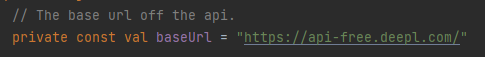

And in “com/example/msafe/api/ApiService.kt”, change the POST request:

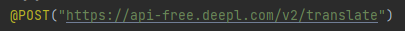

Pro

Go to “com/example/msafe/api/Api.kt”, and change the baseUrl:

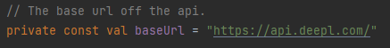

And in “com/example/msafe/api/ApiService.kt”, change the POST request:

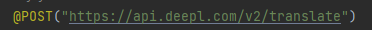

Now you can run the app and all translate features will work automatically. You can monitor your usage in your DeepL account.

## **database**

- Information.kt
  - Documentation:
  - Function: \
    (image of function itself delete text when image present)
- LoginHistory.kt
  - Documentation:
  - Function: \
    (image of function itself delete text when image present)

## **model**

- Data.kt

  This is a data class which contains a serialized name with List\<Any\> as datatype. The text in the Json which will be retrieved is in the form of a list, this is the reason for this datatype.
- Translate.kt

  This class contains several functions that are used by other classes for translating the application. The "getAllResourceString" function makes one big string out of all string resources the application has. This will later be used to send to the API to translate:

  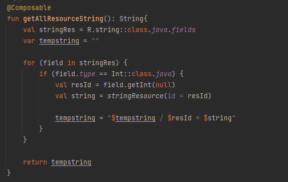

  The rest of the functions are all used to convert certain language codes to full names (or the other way around). Also one function returns the resource ID of the country flag which belongs to the given country ID.

## **repository**

- Repository.kt

  The repository creates an ApiService to use for getting the translation from the API server. This class contains one function which retrieves the data using this ApiService:

  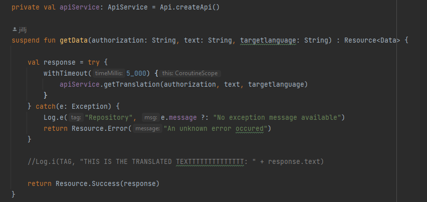

  ApiService is an interface which contains the queries to send to the API service. This is the interface:

  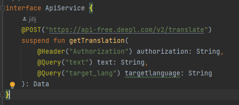

## **ui**

- screens
- BiometricsScreen.kt

  This application uses 2 forms of biometrics: Face-ID and fingerprint identification. These are retrieved from the device, so it uses the saved identifications from the device.

  In “com/example/msafe/ui/screens/BiometricsScreen.kt”, a check is done to see whether the device has biometrics available or not:

  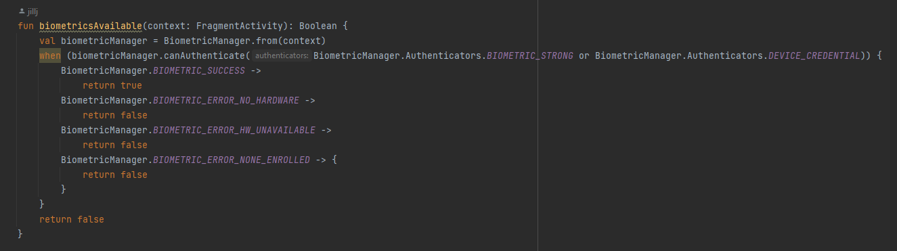

  It uses a class “BiometricManager” which provides system information related to biometrics (e.g. fingerprint, face, etc.).

  If the device has biometrics, a system provided pop-up screen will show, asking the user to identify himself (face-ID/fingerprint identification). For this, a class is used that manages a system-provided biometric prompt (BiometricPrompt).

  If the device does not have biometrics, a pop-up with a pincode shows up instead. This pincode should be filled in on the computer screen of the user.

  After completing either of these two identifications, the system completes this by redirecting to “com/example/msafe/ui/screens/SuccessfulScreen.kt”.
- HistoryScreen.kt
  - Documentation:
  - Function: \
    (image of function itself delete text when image present)
- HomeScreen.kt

  This class contains all the code for the home screen, also the lay-out. It first retrieves the cached data to use that for displaying the text and language.

  Retrieving the cached language to display the flag in the bottom right corner (in the settingsscreen):

  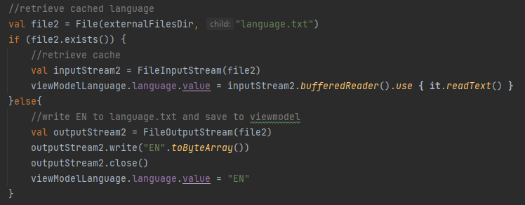

  Retrieving the cached string and putting it in the hashmap for the app to use:

  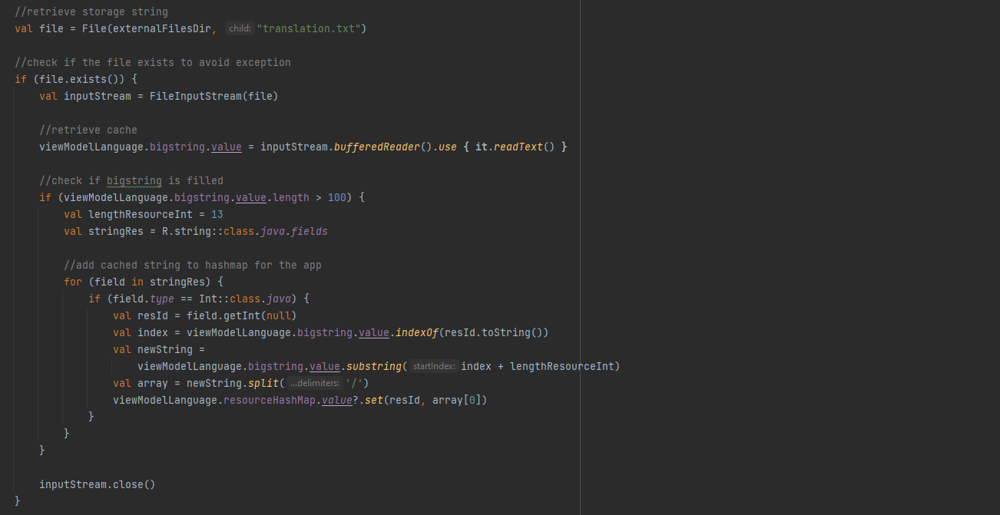

  First an input stream is opened with the cached file containing the last translated string. Then a for loop is created to retrieve all the resource ID's which will be used as key in the hashmap. Next up there is a search in the translated string for the resID so that the right string belonging to it is retrieved. This string will be added as a value in the hashmap (with its resID as a key).

  If the user clicked the exit button, a the PushNotification class will be called and an exit pop-up will be shown:

  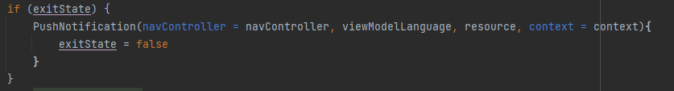
- LanguageScreen.kt

  The user can click on the flag in the corner to change the language of the application. When clicked upon, it redirects to “com/example/msafe/ui/screens/LanguageScreen.kt”.

  A list with multiple languages pops up, which the user can select from. When the user clicks on the confirm button, a series of events occur.

  The new language is saved to ”com/example/msafe/ui/viewModel/ChangeLanguageViewModel.kt”, and will be cached in an external directory:

  

  After saving the language, this language is used to translate the application. A function “translateApp” is used from the viewmodel:

  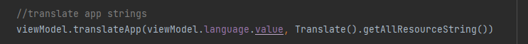

  After sending a request to the DeepL api to translate the application, a wait function is used to wait for the API to finish the call.

  There are 2 spots in the application from where you can change the language:

  “com/example/msafe/ui/screens/SignInScreen.kt”

  “com/example/msafe/ui/screens/SettingsScreen.kt”

  Next up, there will be a check to see if the “user” variable is null or not, to check whether there has been logged in yet.  If so, that means the user came from the settings screen. If not, the user came from the sign in screen. First there will be a wait, this is to wait for the api to finish the request:

  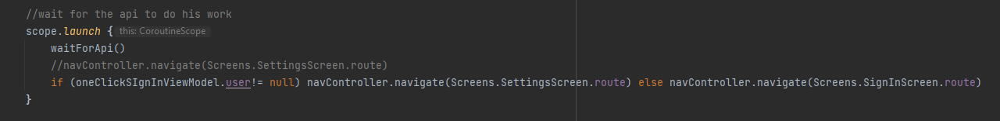

  After redirecting to the right screen, the app has been translated into the new language. Also now, the translations of the screen will be saved as cache. It does this by saving all the resources as one big string. This way only one spot in the cache is used, which saves a lot of memory. Also, by making one big string out of all string resources, only one call to the API is needed which makes the translation process a lot faster.
- PasswordResetScreen.kt
  - Documentation:
  - Function: \
    (image of function itself delete text when image present)
- ProfileScreen.kt

  This screen contains the button for logging out. It does this by using Firebase to signout. Also, in the viewmodel the user is set to null (since no one is logged in anymore):

  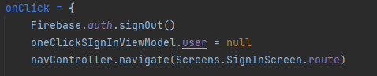
- QrCodeAnalyzer.kt
  - Documentation:
  - Function: \
    (image of function itself delete text when image present)
- QrInfoScreen.kt
  - Documentation:
  - Function: \
    (image of function itself delete text when image present)
- QrScreen.kt
  - Documentation:
  - Function: \
    (image of function itself delete text when image present)
- Screens.kt

  Here all screens of the applications are defined. They are all given a route name to use for the navcontroller.
- SettingsScreen.kt

  In this screen the translated string is being cached. It does this by opening an FileOutputStream and writing to it:

  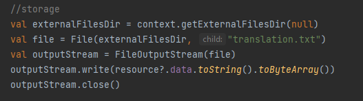

  Also, the big translated string is divided in small strings and added to the hashmap. See the documentation on homescreen to view a more detailed explanation of this statement:

  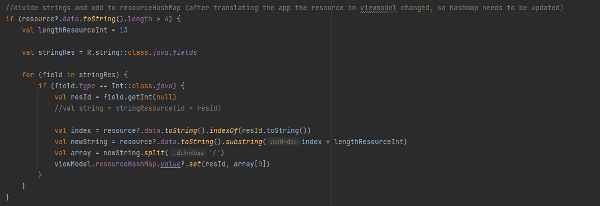
- SignInScreen.kt
  - Documentation:
  - Function: \
    (image of function itself delete text when image present)
- SignUpScreen.kt
  - Documentation:
  - Function: \
    (image of function itself delete text when image present)
- SplashScreen.kt
  - Documentation:
  - Function: \
    (image of function itself delete text when image present)
- SuccessfulScreen.kt
  - Documentation:
  - Function: \
    (image of function itself delete text when image present)
- TexToSpeechScreen.kt
  - Documentation:
  - Function: \
    (image of function itself delete text when image present)
- **theme**
- Color.kt
  - Documentation:
  - Function: \
    (image of function itself delete text when image present)
- viewModel
- ChangeLanguageViewModel.kt
  - Documentation:
  - Function: \
    (image of function itself delete text when image present)
- OneClickSignInViewModel.kt
  - Documentation:
  - Function: \
    (image of function itself delete text when image present)

## **util**

- Resource.kt
  - Documentation:
  - Function: \
    (image of function itself delete text when image present)