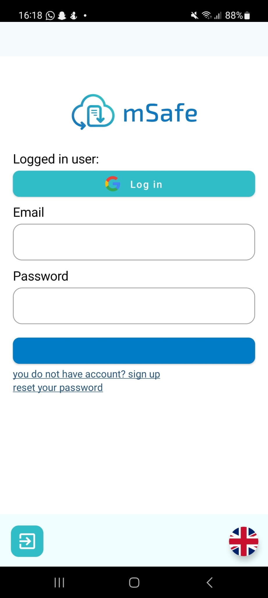
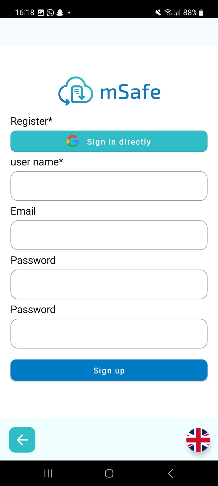
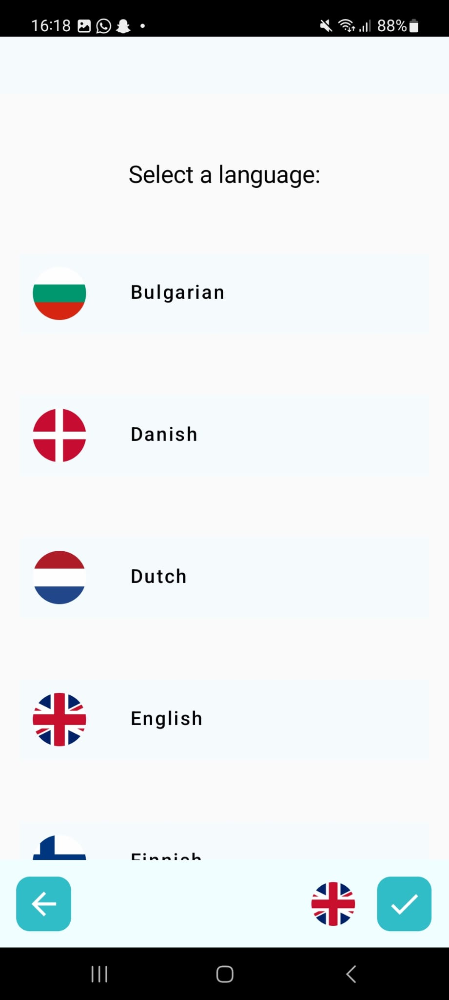
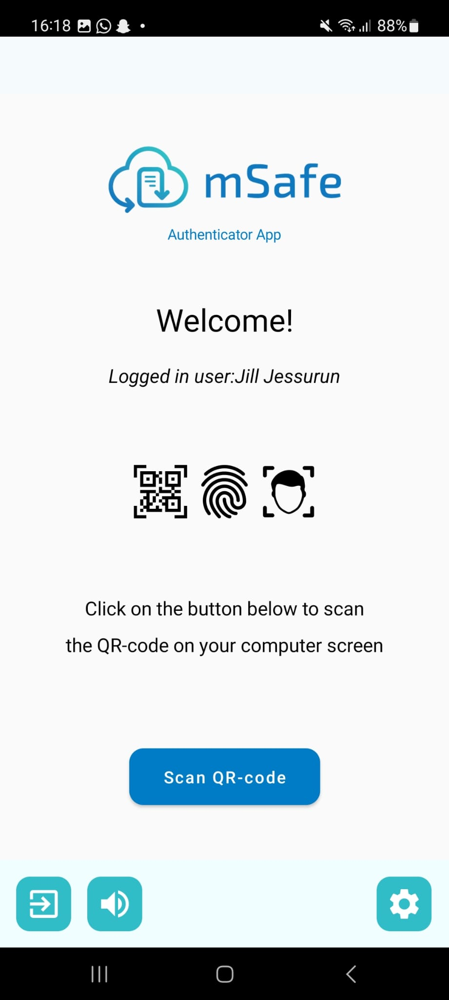
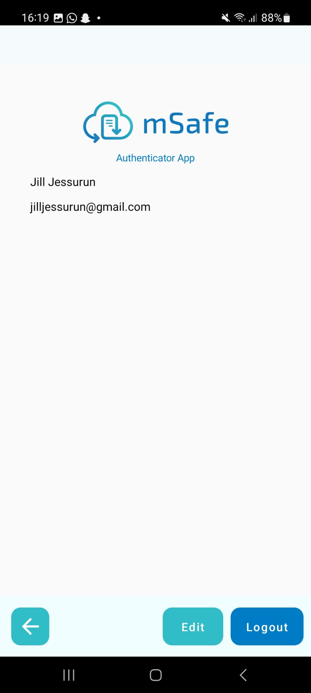

## SignIn Screen

- In this Screen User can login using Google account or existing mSafe account.
- If the User doesn't have account, User can go to 'sign up' screen.
- User can also reset password through the 'reset your password' screen.
- Below on the left, User can exit the app through this button.
- Below on the right, User can change their languages. It automatically change the whole app language.

***

  

# SignUp Screen

- You can register with a Google account even on the Sign Up screen.
- It consists of a username, email, password, and password confirmation field.
- By pressing the Sign up button, your account will be registered.
- The bottom is composed of a back button and a language change button.

***

  

## Language Screen

- In the language screen, users can set the language of the entire app according to their desired language.
- You can choose from a total of 19 languages.
- At the bottom, it is composed of a back button, a flag where users can check the language they have selected, and a confirmation button.

***

  

## Home Screen

- The home screen is shown to users once they have successfully logged in.
- On the home screen, you can see the name of the logged-in user along with a welcome greeting.
- There is a button that allows you to transition to the function that can scan QR codes.
- The bottom is composed of a button to exit the app, a text-reading function, and a button to transition to the settings screen.

***

  

## Setting Screen

- The profile in the settings screen displays information about the user.
- The language button takes you to the language change screen.
- In the case of History, it shows the user's login record.
- The Share button helps you share with other apps. (As it's currently not possible to launch on Google Play, it's linked to the mSafe web link.)

***

  

## Profile Screen

- The profile screen displays information about the user.
- At the bottom, it is composed of a back button, an edit button, and a logout button.

